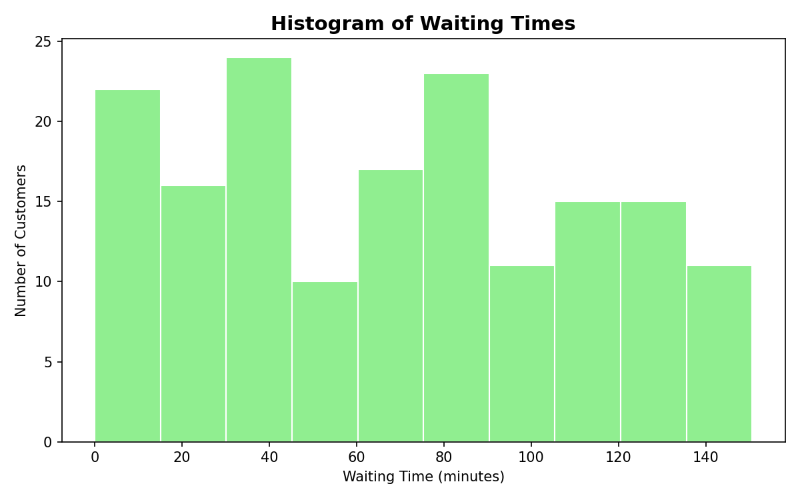
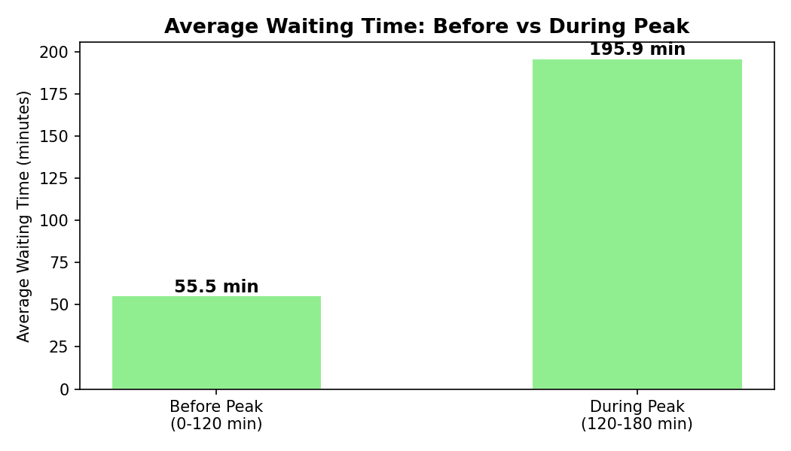
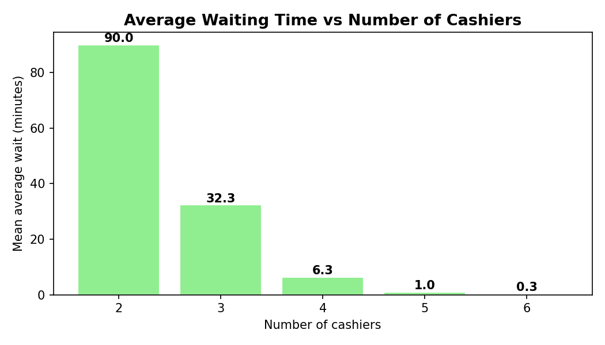

# Monte Carlo Queue Simulation — How Many Cashiers Does a Shop Need?


A discrete-event **Monte Carlo simulation** of a shop checkout with a shared queue.
It models random customer arrivals and service times over a 3-hour shift, measures how long
customers wait, tests how the system reacts to a **peak hour**, and finds the number of
cashiers needed to keep waiting times low.

---

##  The Problem

A shop runs **2 cashiers** for a **180-minute** shift. Management wants to know:

1. Do customers wait too long?
2. What happens when the arrival rate doubles during the last hour (peak hour)?
3. How many cashiers are actually needed?

##  Model Assumptions

| Parameter | Value | Meaning |
|---|---|---|
| Arrivals | Exponential inter-arrival times, rate **λ = 1 / min** | Poisson arrivals, ~1 customer per minute |
| Peak hour (min 120–180) | Rate **λ = 2 / min** | Arrivals double |
| Service time | **Uniform(2, 6)** minutes | Mean 4 min → **μ = 0.25 / min** per cashier |
| Servers | **2 cashiers** | One shared FIFO queue |
| Shift length | **180 minutes** | Terminating simulation |

In queueing notation this is an **M/G/2** system.

**Traffic intensity:** `ρ = λ / (c·μ) = 1 / (2 × 0.25) = 2`
Since **ρ > 1**, customers arrive faster than two cashiers can serve them, so the queue keeps growing.

##  How the Simulation Works

1. **Generate arrivals** — add random exponential gaps to a clock until the shift ends; give each customer a random service time.
2. **Serve customers in arrival order** — each customer goes to the cashier who becomes free first:
   ```python
   cashier_index = cashiers.index(min(cashiers))   # earliest-free cashier
   start = max(arrival, cashiers[cashier_index])   # wait if cashier is still busy
   wait  = start - arrival
   cashiers[cashier_index] = start + service       # cashier busy until departure
   ```
3. **Measure** average wait, maximum wait, P(wait > 5 min) and offered load.
4. **Repeat 50 times (Monte Carlo)** to estimate the expected result and its variability.
5. **Peak-hour scenario** — compare customers arriving before vs during the peak.
6. **Staffing analysis** — repeat the experiment for 2–6 cashiers.

##  Results

*(seed = 42, so results are reproducible)*

### Base case — 2 cashiers, 50 replications

| Metric | Value |
|---|---|
| Mean of average waiting times | **90.6 min** |
| Standard deviation (between runs) | 15.9 min |
| P(wait > 5 min), single run | ~0.96 |
| Offered load (work ÷ capacity) | ~2.0 |

<p align="center"></p>

Waiting time grows steadily through the shift, so waits are spread from 0 up to ~150+ minutes.

### Peak hour — arrivals double after minute 120

| Metric | Before peak | During peak |
|---|---|---|
| Average wait | 55.5 min | **195.9 min** |
| Max wait | 114.8 min | 290.1 min |
| P(wait > 5 min) | 0.946 | 1.000 |

<p align="center"></p>

### Staffing analysis — how many cashiers are needed?

| Cashiers | ρ | Mean average wait |
|---|---|---|
| 2 | 2.00 | 90.0 min |
| 3 | 1.33 | 32.3 min |
| 4 | 1.00 | 6.3 min |
| **5** | **0.80** | **1.0 min** |
| 6 | 0.67 | 0.3 min |

<p align="center"></p>

##  Conclusions

- **Two cashiers are heavily overloaded** (ρ = 2) — the average customer waits about 1.5 hours.
- **A third cashier helps but is not enough** — ρ = 1.33 is still above 1, so the queue still grows.
- **Five cashiers** bring the system below capacity (ρ = 0.8) and cut the average wait to about **1 minute**.
- The system is **highly sensitive to the arrival rate**: doubling arrivals in the peak hour more than triples waiting times, so extra staff are needed during busy periods.

##  Limitations & Future Improvements

- The "utilisation" figure is really **offered load** (it can exceed 1); true utilisation would measure busy time only.
- Add **confidence intervals** (e.g. 95% CI for the mean wait) and use the sample standard deviation.
- Use **common random numbers** when comparing staffing levels for a fairer comparison.
- Add realistic behaviour: customers leaving long queues, cashier breaks, arrival rates that vary through the day.
- Validate the model against **real shop data**.
- Scale up with **NumPy** (speed), **SciPy** (statistics) or **SimPy** (discrete-event simulation).

##  How to Run

```bash
git clone https://github.com/<your-username>/monte-carlo-queue-simulation.git
cd monte-carlo-queue-simulation
pip install -r requirements.txt

python monte_carlo_simulation.py   # main simulation (Parts C, D, E + peak hour)
python staffing_analysis.py        # compares 2–6 cashiers
```

##  Project Structure

```
monte-carlo-queue-simulation/
├── monte_carlo_simulation.py   # main simulation, fully commented
├── staffing_analysis.py        # extension: 2–6 cashier comparison
├── requirements.txt            # dependencies (matplotlib)
├── histogram_normal.png        # waiting-time distribution (2 cashiers)
├── histogram_peak.png          # waiting-time distribution (peak hour)
├── comparison_chart.png        # before vs during peak
├── staffing_chart.png          # wait vs number of cashiers
└── README.md
```

##  Technologies

- **Python** — simulation logic
- **random** — exponential & uniform random sampling
- **math** — statistics helpers
- **Matplotlib** — histograms and bar charts

---

**Author:** Noorie — University of Mauritius
